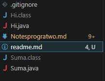

# prj Inicial 


## estruc. de proyecto 
```text
📁 proyecto/
 ├── Hi.java          # Programa de saludo
 ├── Suma.java        # Programa para sumar números
 ├── readme.md        # Documentación del proyecto
 ├── .gitignore       # Archivos ignorados por Git
```

## **imagen de estructura**


